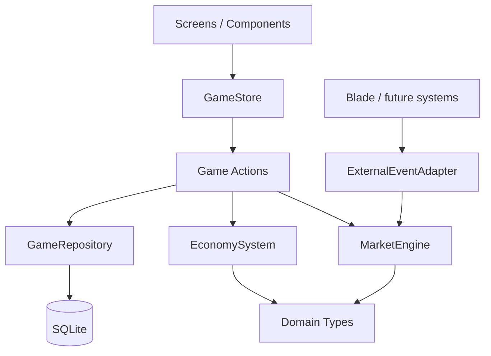
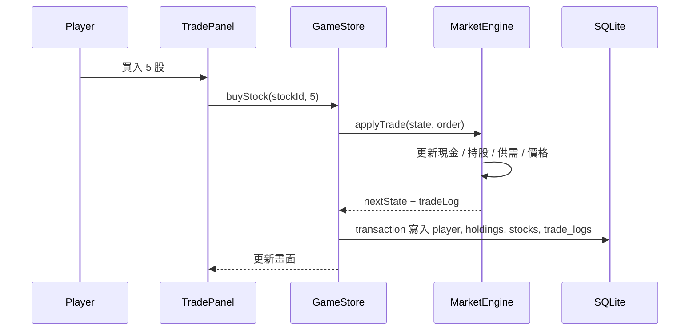

# STOCKY React Native MVP Plan

## 1. 專案架構圖



原則：手機單機優先，SQLite 是唯一持久化來源；UI 不直接算價格、不直接寫 DB。

## 2. React Native Folder Structure

```txt
src/
  components/
    economy/
      EconomyGauge.tsx
      EconomyHeader.tsx
    market/
      StockCard.tsx
      StockDetail.tsx
      StockRail.tsx
      TradePanel.tsx
    portfolio/
      HoldingRow.tsx
      PortfolioPanel.tsx
    news/
      NewsFeed.tsx
      ForesightPanel.tsx
  screens/
    MarketScreen.tsx
    PortfolioScreen.tsx
    NewsScreen.tsx
  systems/
    market/
      MarketEngine.ts
      PricingSystem.ts
      TradeSystem.ts
      ExternalEventAdapter.ts
      seedStocks.ts
    economy/
      EconomySystem.ts
      StabilityFundSystem.ts
    token/
      TokenSystem.ts
  database/
    schema.ts
    migrations.ts
    sqlite.ts
    repositories/
      GameRepository.ts
  hooks/
    useGameActions.ts
    useBootstrapGame.ts
    useSelectedStock.ts
  store/
    GameStore.tsx
    gameReducer.ts
  types/
    domain.ts
    database.ts
    externalEvent.ts
```

## 3. 資料流圖



## 4. SQLite Schema

```sql
CREATE TABLE IF NOT EXISTS player (
  id TEXT PRIMARY KEY NOT NULL,
  cash REAL NOT NULL,
  token INTEGER NOT NULL,
  created_at TEXT NOT NULL,
  updated_at TEXT NOT NULL
);

CREATE TABLE IF NOT EXISTS economy_state (
  id TEXT PRIMARY KEY NOT NULL,
  day INTEGER NOT NULL,
  inflation REAL NOT NULL,
  market_heat REAL NOT NULL,
  stability_fund REAL NOT NULL,
  foresight_used_today INTEGER NOT NULL,
  updated_at TEXT NOT NULL
);

CREATE TABLE IF NOT EXISTS stocks (
  id TEXT PRIMARY KEY NOT NULL,
  code TEXT NOT NULL,
  name TEXT NOT NULL,
  sector TEXT NOT NULL,
  base_price REAL NOT NULL,
  price REAL NOT NULL,
  supply REAL NOT NULL,
  demand REAL NOT NULL,
  stability REAL NOT NULL,
  volatility REAL NOT NULL,
  description TEXT NOT NULL,
  updated_at TEXT NOT NULL
);

CREATE TABLE IF NOT EXISTS holdings (
  stock_id TEXT PRIMARY KEY NOT NULL,
  shares INTEGER NOT NULL,
  average_cost REAL NOT NULL,
  updated_at TEXT NOT NULL,
  FOREIGN KEY (stock_id) REFERENCES stocks(id)
);

CREATE TABLE IF NOT EXISTS trade_logs (
  id TEXT PRIMARY KEY NOT NULL,
  day INTEGER NOT NULL,
  stock_id TEXT NOT NULL,
  side TEXT NOT NULL,
  shares INTEGER NOT NULL,
  price REAL NOT NULL,
  fee REAL NOT NULL,
  total REAL NOT NULL,
  created_at TEXT NOT NULL
);

CREATE TABLE IF NOT EXISTS market_logs (
  id TEXT PRIMARY KEY NOT NULL,
  day INTEGER NOT NULL,
  type TEXT NOT NULL,
  title TEXT NOT NULL,
  body TEXT NOT NULL,
  payload_json TEXT,
  created_at TEXT NOT NULL
);
```

P0 可以先用整包 snapshot 存檔；上面 schema 是正式 MVP 目標。若時間緊，先把 `game_state(id, payload)` 留著，第二輪再正規化。

## 5. TypeScript Interfaces

核心型別放在 `src/types/domain.ts`。外部事件用 `ExternalMarketEvent`，市場組只暴露 `applyExternalEvent(event)`。

## 6. 系統模組拆分

- `MarketEngine`: 純函式，不碰 UI、不碰 SQLite。
- `TradeSystem`: 驗證現金/持股，產生交易結果。
- `PricingSystem`: 供需、通膨、熱度、穩定度、波動率的價格計算。
- `EconomySystem`: 每日推進、通膨、市場熱度。
- `StabilityFundSystem`: 防通膨與過熱干預。
- `TokenSystem`: 代幣消耗、每日重置、每 5 天獎勵。
- `GameRepository`: SQLite 讀寫與 transaction。
- `GameStore`: UI 狀態入口。

## 7. MVP 開發順序

P0 必做：

1. Expo + TypeScript 專案可在手機/模擬器跑。
2. SQLite 初始化與 seed 資料。
3. MarketScreen：股票列表、股票詳情、買賣面板。
4. 買賣資料流：更新持股、供需、價格、現金、交易紀錄。
5. 每日推進：價格重算、通膨、熱度、穩定基金。
6. PortfolioScreen：現金、總資產、持股、損益。
7. NewsScreen：交易紀錄、市場紀錄。
8. Reset demo data。

P1 第二階段：

1. 圖表與價格歷史。
2. 新手教學與數值說明。
3. 成就/技能/轉生系統接點。
4. Blade 外部事件接入。
5. 假情報/多人聊天的 UI prototype。
6. 平衡性工具頁。

## 8. 狀態管理建議

P0 建議用 `Context API + useReducer`：

- 不增加依賴，Expo 最穩。
- 大學生團隊容易理解。
- 狀態集中，debug 容易。
- 市場邏輯仍在 systems，不會把 reducer 寫爆。

P1 若狀態變多，再換 Zustand：

- API 輕，適合 game state。
- 比 Redux 少樣板。
- 可把 UI 狀態與 domain state 分開。

暫不建議 Redux：對目前單機 MVP 過重。

## 9. localStorage -> SQLite 遷移

1. 保留 HTML demo 當展示與數值參考。
2. 將 HTML 的 `createInitialState`, `buyStock`, `sellStock`, `advanceDay` 搬到 `systems` 純函式。
3. SQLite 第一次啟動時執行 migrations。
4. 沒資料時 seed `stocks`, `player`, `economy_state`。
5. 每個 action 都走 repository transaction。
6. 若要吃 HTML 存檔，可做一次 JSON import，把 localStorage 匯出的 state 寫入 SQLite。

## 10. Blade 接入設計

市場組只實作：

```ts
applyExternalEvent(state, event): GameState
```

Blade 組只需要給：

```ts
{
  id: string;
  title: string;
  day: number;
  duration: number;
  sectorImpacts: { food?: number; energy?: number; tech?: number; logistics?: number; luxury?: number };
  inflationImpact: number;
  heatImpact: number;
}
```

市場不理解劇情，只吃數值影響。這樣責任邊界乾淨。

## 11. 風險分析

- 數值失控：每日價格需要 clamp，上限/下限先保守。
- DB 寫入錯誤：買賣與每日推進必須 transaction。
- UI 和系統耦合：UI 不直接修改 stock，全部走 action。
- 團隊分工衝突：Blade 事件只透過 adapter 接進市場。
- Expo 套件版本：先固定 Expo SDK 與 expo-sqlite 版本。

## 12. 建議時程

- Day 1：建立 Expo 專案、資料夾、型別、SQLite migrations。
- Day 2：搬 MarketEngine / TradeSystem / EconomySystem。
- Day 3：MarketScreen + TradePanel 可操作。
- Day 4：PortfolioScreen + NewsScreen + reset。
- Day 5：手機測試、數值微調、展示流程整理。
- Day 6-7：P1 小功能與 Blade adapter mock。
